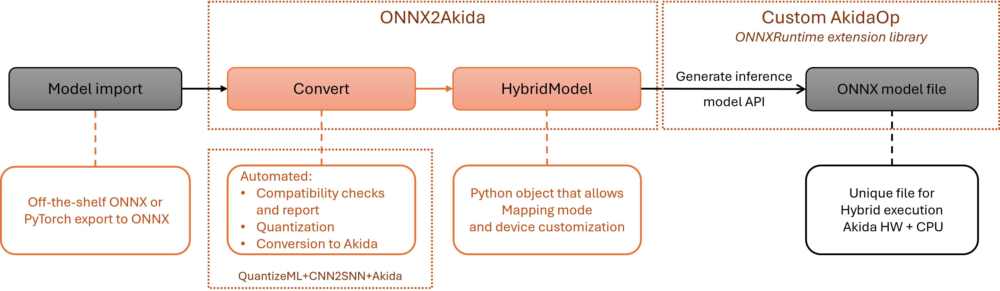

Overview
========

.. toctree::
   :hidden:
   :maxdepth: 2

   self
   Installation <./installation.rst>
   User guide <./user_guide/user_guide.rst>
   API reference <./api_reference/api_reference.rst>
   Examples <./examples/index.rst>
   Changelog <./changelog.rst>
   Support <https://support.brainchip.com/portal/home>
   ./license.rst

The MetaONNX Framework
----------------------

The MetaONNX Framework is a dedicated toolchain designed specifically for deploying
ONNX models on the `Akida 2nd Generation Neuromorphic Processor
<https://brainchip.com/wp-content/uploads/2025/04/Akida-2-IP-Product-Brief-V2.0-1.pdf>`_.
MetaONNX enables the execution of **any ONNX model** regardless of operator support on Akida
hardware by combining neuromorphic acceleration with CPU fallback execution for operators that are
not supported by Akida.
Built on the industry-standard `ONNX <https://onnx.ai/>`_ format, MetaONNX provides
tools for analyzing model compatibility, automatically partitioning models into
Akida-accelerated and CPU-executed subgraphs, and generating heterogeneous inference
models that maximize hardware utilization while ensuring complete model execution.

MetaONNX consists of the **onnx2akida** Python package and the **onnxruntime-akida**
execution provider, both installed from the `PyPI <https://pypi.org/>`_ repository
via the `pip` command. The framework provides:

   * **ONNX model ingestion** - accepts any valid ONNX model as input, regardless of
     operator support on Akida hardware,

   * **automatic graph partitioning** - analyzes the model graph and intelligently
     partitions it into subgraphs for optimal execution on Akida hardware and CPU,

   * **Akida Execution Provider** - a core component that identifies and assigns
     supported neural network operators to the Akida 2nd Generation hardware,

   * **CPU fallback execution** - ensures operators not supported by Akida can be
     executed on CPU,

   * **device estimation tools** - determines the minimum Akida hardware configuration
     required for a given model,

   * **developer-friendly APIs** - Python API and CLI tools (`onnx2akida`,
     `onnx2akida-device`) integrated with ONNX Runtime for seamless deployment workflows.

The onnx2akida toolkit works with models from any framework that supports ONNX export,
including TensorFlow (via `tf2onnx <https://github.com/onnx/tensorflow-onnx>`_),
PyTorch (via `torch.onnx <https://pytorch.org/docs/stable/onnx.html>`_), and
Hugging Face models (via `Optimum <https://huggingface.co/docs/optimum/>`_).
This broad compatibility enables developers to bring their existing models to the
Akida platform without being constrained by hardware-specific operator limitations.

   MetaONNX execution flow

The **Akida Execution Provider** functions as a custom provider within
the ONNX Runtime framework, orchestrating heterogeneous execution between Akida
hardware and CPU. This architecture enables:

   * **universal model support** - execute any ONNX model, even those with operators
     not supported by Akida, by automatically managing CPU fallback execution,

   * **optimized performance** - leverage Akida's neuromorphic architecture for
     supported operations while maintaining accuracy with CPU execution for unsupported
     layers, minimizing data transfer overhead,

   * **seamless integration** - generated hybrid models use standard ONNX format with
     custom `AkidaOp`` nodes, allowing integration with existing ONNX-based pipelines
     and embedded systems.

The MetaONNX examples
---------------------

The `examples section <./examples/index.html>`_ includes tutorials demonstrating the
onnx2akida workflow on various model architectures. These examples illustrate:

   * How to analyze ONNX model compatibility with Akida hardware
   * Converting models from popular frameworks (TensorFlow, PyTorch, Hugging Face)
   * Generating and using hybrid inference models
   * Estimating hardware requirements for deployment

.. warning::
    While the MetaONNX examples are provided under an
    `Apache License 2.0 <https://www.apache.org/licenses/LICENSE-2.0.txt>`_,
    the underlying Akida library is proprietary.
    Please refer to the `End User License Agreement <./license.html>`__ for
    terms and conditions.
